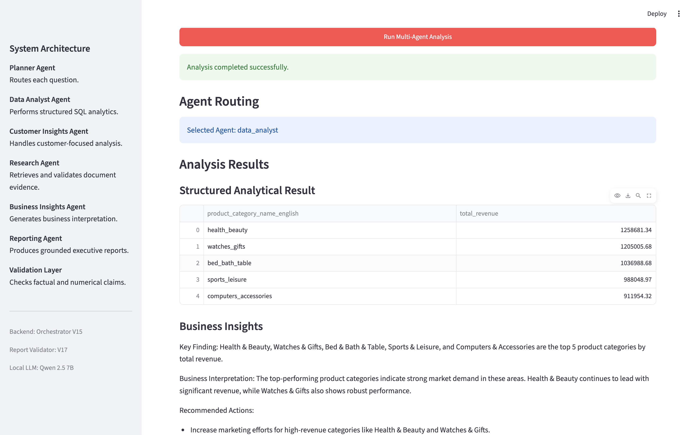

# Multi-Agent Enterprise Intelligence System

> A production-style multi-agent AI system for **enterprise analytics, customer intelligence, document research, grounded reporting, automated evaluation, and observability**.

The platform combines **Large Language Models, Retrieval-Augmented Generation (RAG), SQL analytics, deterministic validation, Streamlit, and MLflow** into one orchestrated workflow.

It runs locally using **Qwen 2.5 7B through Ollama**, uses **DuckDB** for structured analytics, **ChromaDB + Sentence Transformers** for semantic retrieval, and validates generated conclusions before presenting them to the user.


It runs locally using **Qwen 2.5 7B through Ollama**, uses **DuckDB** for structured analytics, **ChromaDB + Sentence Transformers** for semantic retrieval, and validates generated conclusions before presenting them to the user.

---

## Demo



*Example structured analytics workflow showing agent routing, validated SQL results, and generated business insights.*
---

## Project Highlights

| Capability | Implementation |
|---|---|
| Multi-Agent Routing | Planner dynamically selects specialized agents |
| Structured Analytics | DuckDB + SQL |
| Customer Intelligence | Customer-level analytical workflows |
| Enterprise RAG | ChromaDB + Sentence Transformers |
| Local LLM | Qwen 2.5 7B via Ollama |
| Research Grounding | Evidence retrieval + claim validation |
| Hallucination Control | Deterministic numerical and factual checks |
| Executive Reporting | Evidence-constrained Reporting Agent |
| Automated Evaluation | Multi-route regression testing |
| Observability | MLflow |
| User Interface | Streamlit |

---

## Verified Results

The stable system has been tested across analytics, research, reporting, validation, and end-to-end orchestration.

```text
Automated Evaluation       4 / 4 passed
Evaluation Success Rate    100%

Research Validator         7 / 7 passed
Report Validator          39 / 39 passed
Reporting Agent            2 / 2 passed
End-to-End Orchestrator    4 / 4 passed
```

Example verified results:

```text
Repeat customers:
2,997

Highest-revenue product category:
health_beauty — 1,258,681.34
```

---

# Architecture

```text
                         Business Question
                                |
                                v
                       +------------------+
                       |    Streamlit     |
                       +------------------+
                                |
                                v
                       +------------------+
                       | MLflow Tracking  |
                       +------------------+
                                |
                                v
                       +------------------+
                       |  Planner Agent   |
                       +------------------+
                                |
                +---------------+---------------+
                |               |               |
                v               v               v
        +---------------+ +-------------+ +---------------+
        | Data Analyst  | |  Customer   | |   Research    |
        |     Agent     | |Insights Agent| |     Agent     |
        +---------------+ +-------------+ +---------------+
                |               |               |
                v               v               v
             DuckDB          DuckDB       ChromaDB + RAG
                |               |               |
                +---------------+---------------+
                                |
                                v
                       +------------------+
                       |Business Insights |
                       +------------------+
                                |
                                v
                       +------------------+
                       | Reporting Agent  |
                       +------------------+
                                |
                                v
                       +------------------+
                       | Validation Layer |
                       +------------------+
                                |
                                v
                      Grounded Final Output
```

---

# Why Multi-Agent?

Enterprise questions often require different types of reasoning and data access.

A user may need to:

- analyze transactional data,
- understand customer behavior,
- retrieve information from business documents,
- generate business insights,
- create an executive summary,
- verify that conclusions are supported by evidence.

Instead of sending every question through one general-purpose LLM workflow, this project uses **specialized agents**.

The Planner Agent identifies the intent of the question and routes it to the appropriate analytical path.

This makes the system easier to test, validate, debug, observe, and extend.

---

# Core Agents

## Planner Agent

Determines the user's intent and selects the appropriate specialized agent.

```text
agents/planner_agent_v4.py
```

---

## Data Analyst Agent

Handles structured analytical questions using DuckDB and SQL.

Example:

```text
Which product categories generate the highest revenue?
```

Stable implementation:

```text
agents/data_analyst_agent_v4.py
```

---

## Customer Insights Agent

Handles customer-oriented analytical questions.

Example:

```text
How many repeat customers do we have?
```

Verified result:

```text
2,997
```

Stable implementation:

```text
agents/customer_insights_agent_v2.py
```

---

## Research Agent

Handles questions requiring information from enterprise documents.

Example:

```text
What did management report about Q2 pricing?
```

The agent retrieves relevant evidence through the RAG pipeline before generating a finding.

Stable implementation:

```text
agents/research_agent_v10.py
```

---

## Reporting Agent

Transforms analytical results into concise executive-level reports.

Generated reports are passed through a separate validation layer before being returned.

Stable implementation:

```text
agents/reporting_agent_v12.py
```

---

# Retrieval-Augmented Generation

The document intelligence workflow uses semantic retrieval rather than relying only on the LLM's internal knowledge.

```text
Enterprise Documents
        |
        v
Document Processing
        |
        v
Sentence Transformer
        |
        v
Embeddings
        |
        v
ChromaDB
        |
        v
Semantic Retrieval
        |
        v
Supporting Evidence
        |
        v
Research Agent
        |
        v
Research Validator
        |
        v
Grounded Finding
```

Embedding model:

```text
all-MiniLM-L6-v2
```

Embedding dimensionality:

```text
384
```

This enables the system to retrieve relevant evidence even when the wording of a question differs from the source document.

---

# Grounding and Validation

A core design goal of the project is reducing unsupported LLM conclusions.

The system does not rely only on prompting to prevent hallucinations.

Instead, generation and validation are separate responsibilities.

---

## Research Validator

Research findings are checked against retrieved source evidence.

```text
tools/research_validator_v7.py
```

Verified tests:

```text
7 / 7 passed
```

---

## Report Validator

Executive reports are checked against upstream analytical evidence.

```text
tools/report_validator_v17.py
```

Verified tests:

```text
39 / 39 passed
```

The validator checks important categories including:

- numerical claims,
- rankings,
- unsupported comparisons,
- factual support,
- evidence consistency.

---

## Deterministic Validation

Exact facts should not depend entirely on probabilistic LLM judgment.

The architecture therefore keeps important deterministic logic in Python.

```text
LLM
 |
 | Semantic reasoning
 v
Generated Claim
 |
 v
Python Validation
 |
 | Numbers / rankings / structured facts
 v
Validated Output
```

Python is responsible for exact numerical and ranking logic whenever those facts can be derived deterministically.

The LLM is primarily used for semantic interpretation and language generation.

---

# Orchestration

The orchestrator coordinates the complete workflow.

```text
orchestration/orchestrator_v15.py
```

Responsibilities include:

- processing the user question,
- calling the Planner Agent,
- executing the selected specialized agent,
- generating business insights,
- generating reports,
- validating outputs,
- retrying when necessary,
- constructing the final response.

Verified end-to-end tests:

```text
4 / 4 passed
```

---

# Example Workflow

For:

```text
How many repeat customers do we have?
```

the system executes approximately:

```text
User
 |
 v
Streamlit
 |
 v
MLflow Tracker
 |
 v
Orchestrator
 |
 v
Planner Agent
 |
 v
Customer Insights Agent
 |
 v
DuckDB
 |
 v
2,997 Repeat Customers
 |
 v
Business Insights
 |
 v
Reporting Agent
 |
 v
Report Validator
 |
 v
Grounded Executive Report
```

If the generated report contains an unsupported claim, validation can reject it and trigger another reporting attempt.

---

# Automated Evaluation

Multi-agent systems can regress when routing logic, prompts, retrieval behavior, or validators change.

The project therefore includes an automated evaluation framework.

```text
evaluation/evaluation_cases.py
evaluation/run_evaluation.py
```

Current baseline:

```text
Passed:       4
Failed:       0
Success Rate: 100%
```

The evaluation suite tests representative questions across multiple routing paths.

Run it with:

```bash
python -m evaluation.run_evaluation
```

---

# MLflow Observability

MLflow provides visibility into multi-agent execution.

Stable tracker:

```text
observability/mlflow_tracker_v2.py
```

Tracked parameters include:

```text
question
selected_agent
orchestrator_version
local_llm
execution_status
```

Tracked metrics include:

```text
latency_seconds
report_validation_attempts
report_valid
```

This provides an execution trail showing:

- which agent handled the request,
- which model was used,
- how long the workflow took,
- whether validation succeeded,
- how many report attempts were required.

Streamlit V5 automatically sends application executions through this tracking layer.

---

# Streamlit Application

The interactive application is implemented in:

```text
app/streamlit_app_v5.py
```

Users can:

- enter business questions,
- run the multi-agent workflow,
- inspect the selected agent,
- view structured results,
- inspect business insights,
- review research evidence,
- read grounded executive reports,
- inspect validation attempts.

Application execution follows:

```text
Streamlit V5
     |
     v
MLflow Tracker V2
     |
     v
Orchestrator V15
     |
     v
Multi-Agent Workflow
```

---

# Technology Stack

| Layer | Technology |
|---|---|
| Language | Python |
| Large Language Model | Qwen 2.5 7B Instruct |
| Model Runtime | Ollama |
| Structured Analytics | DuckDB |
| Data Processing | Pandas |
| Vector Database | ChromaDB |
| Embeddings | Sentence Transformers |
| Embedding Model | all-MiniLM-L6-v2 |
| Retrieval | Semantic Vector Search |
| Architecture | Multi-Agent System |
| Knowledge Retrieval | Retrieval-Augmented Generation |
| Application | Streamlit |
| Observability | MLflow |
| Version Control | Git / GitHub |

---

# Stable Versions

| Component | Version |
|---|---|
| Planner Agent | `planner_agent_v4.py` |
| Data Analyst Agent | `data_analyst_agent_v4.py` |
| Customer Insights Agent | `customer_insights_agent_v2.py` |
| Research Agent | `research_agent_v10.py` |
| Reporting Agent | `reporting_agent_v12.py` |
| Research Validator | `research_validator_v7.py` |
| Report Validator | `report_validator_v17.py` |
| Orchestrator | `orchestrator_v15.py` |
| MLflow Tracker | `mlflow_tracker_v2.py` |
| Streamlit Application | `streamlit_app_v5.py` |

Earlier versions are retained during development so experiments and architectural changes remain traceable.

---

# Project Structure

```text
multi-agent-enterprise-intelligence/
│
├── agents/
│   ├── planner_agent_v4.py
│   ├── data_analyst_agent_v4.py
│   ├── customer_insights_agent_v2.py
│   ├── research_agent_v10.py
│   └── reporting_agent_v12.py
│
├── app/
│   └── streamlit_app_v5.py
│
├── data/
│   └── documents/
│
├── evaluation/
│   ├── evaluation_cases.py
│   └── run_evaluation.py
│
├── observability/
│   ├── mlflow_tracker_v2.py
│   └── test_mlflow_tracker_v2.py
│
├── orchestration/
│   └── orchestrator_v15.py
│
├── tools/
│   ├── research_validator_v7.py
│   └── report_validator_v17.py
│
├── README.md
├── requirements.txt
└── .gitignore
```

---

# Running Locally

## 1. Clone the Repository

```bash
git clone https://github.com/TaduriRahulReddy/multi-agent-enterprise-intelligence.git
cd multi-agent-enterprise-intelligence
```

---

## 2. Create a Virtual Environment

```bash
python3 -m venv venv
source venv/bin/activate
```

---

## 3. Install Dependencies

```bash
pip install -r requirements.txt
```

---

## 4. Download the Local LLM

Install Ollama and pull Qwen:

```bash
ollama pull qwen2.5:7b
```

---

## 5. Start Ollama

Terminal 1:

```bash
ollama serve
```

Keep this terminal running.

---

## 6. Start MLflow

Terminal 2:

```bash
cd multi-agent-enterprise-intelligence
source venv/bin/activate
mlflow ui
```

MLflow normally runs locally at:

```text
http://127.0.0.1:5000
```

---

## 7. Start Streamlit

Terminal 3:

```bash
cd multi-agent-enterprise-intelligence
source venv/bin/activate
streamlit run app/streamlit_app_v5.py
```

Open the local address displayed by Streamlit.

---

# Run the Backend Directly

The orchestrator can also be executed independently of Streamlit:

```bash
python -m orchestration.orchestrator_v15
```

---

# Demo Queries

### Structured Analytics

```text
Which product categories generate the highest revenue?
```

### Customer Intelligence

```text
How many repeat customers do we have?
```

### Enterprise Research

```text
What did management report about Q2 pricing?
```

These questions exercise different agent-routing paths.

---

# Example Analytics Output

Verified category revenue results include:

| Rank | Product Category | Revenue |
|---:|---|---:|
| 1 | health_beauty | 1,258,681.34 |
| 2 | watches_gifts | 1,205,005.68 |
| 3 | bed_bath_table | 1,036,988.68 |
| 4 | sports_leisure | 988,048.97 |
| 5 | computers_accessories | 911,954.32 |

These values come from structured analytical execution rather than LLM generation.

---

# Design Principles

### Specialized Agents

Different tasks use different reasoning and data-access patterns instead of forcing every question through one generic agent.

### Evidence Before Generation

Document-based conclusions begin with retrieved enterprise evidence.

### Deterministic Checks for Deterministic Facts

Exact numerical and ranking relationships are validated using Python whenever possible.

### Independent Validation

The component generating an answer is not solely responsible for determining whether the answer is supported.

### Retry on Validation Failure

Unsupported reports can be rejected and regenerated instead of silently returned.

### Local-First AI

Qwen runs locally through Ollama, reducing dependency on external LLM APIs.

### Observable AI

Routing, latency, validation behavior, model configuration, and execution status are tracked with MLflow.

---

# Engineering Challenges Addressed

This project explores several challenges involved in moving from an LLM prototype toward a more reliable enterprise AI system:

- multi-agent routing,
- structured and unstructured data integration,
- semantic retrieval,
- Retrieval-Augmented Generation,
- hallucination control,
- numerical validation,
- grounded reporting,
- retry mechanisms,
- automated regression evaluation,
- execution observability,
- local LLM inference,
- interactive application development.

---

# Future Improvements

Potential extensions include:

- hybrid keyword + vector retrieval,
- document reranking,
- larger evaluation datasets,
- adversarial hallucination tests,
- route-specific quality metrics,
- per-agent latency tracking,
- prompt version tracking,
- model comparison experiments,
- additional enterprise datasets,
- additional specialized agents,
- Docker containerization,
- authentication and role-based access,
- cloud deployment,
- production monitoring,
- human-in-the-loop validation.

---

# What This Project Demonstrates

The project demonstrates an end-to-end AI engineering workflow spanning:

```text
Multi-Agent Systems
Large Language Models
Retrieval-Augmented Generation
Vector Databases
Embeddings
Semantic Search
SQL Analytics
Agent Orchestration
Hallucination Control
AI Evaluation
AI Observability
Local LLM Inference
Streamlit
MLflow
Git Version Control
```

The architecture moves beyond:

```text
Ask an LLM a question
```

toward:

```text
Route
  ↓
Retrieve / Analyze
  ↓
Generate
  ↓
Validate
  ↓
Evaluate
  ↓
Observe
  ↓
Present
```

That separation of responsibilities is the central engineering idea behind the project.

---

# Author

**Rahul Reddy Taduri**

Data Scientist | Machine Learning & Generative AI Engineer

Focus areas:

- Machine Learning
- Generative AI
- Large Language Models
- Agentic AI
- Retrieval-Augmented Generation
- Natural Language Processing
- Enterprise Analytics
- AI Evaluation and Observability